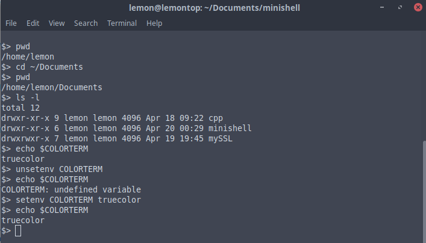

# minishell
A tiny shell

### Installing

```
git clone https://github.com/AustinAWhite/minishell.git
```
in root directory:
```
make
```
an executable 'minishell' will be created

### Usage

once compiled, run the executable
```
./minishell
```
##### Commands

*all commands support '~' and '$' expansions*

* cd [path]
  * change directory. Support for '-'
* echo [-n] [string]
  * standard echo builtin
* env
  * list environment variables
* setenv [name] [value]
  * modify existing environment variable value or create new environment variable
* unsetenv [name]
  * remove environment variable
* exit
  * quit minishell
* help
  * display all available commands and usage


